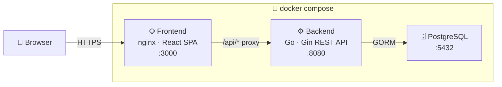
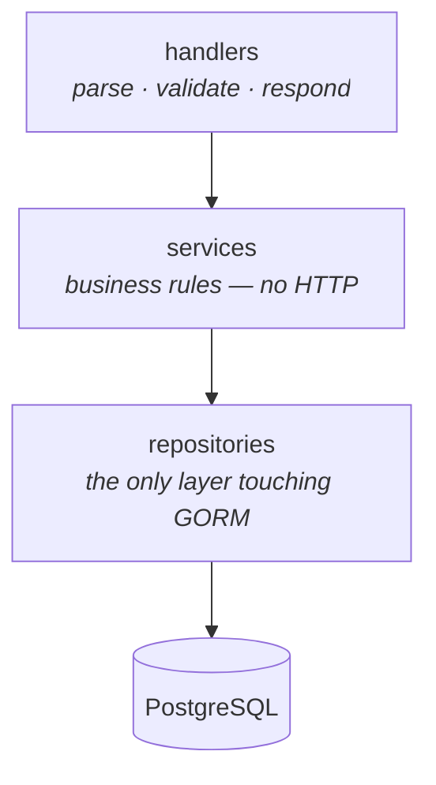
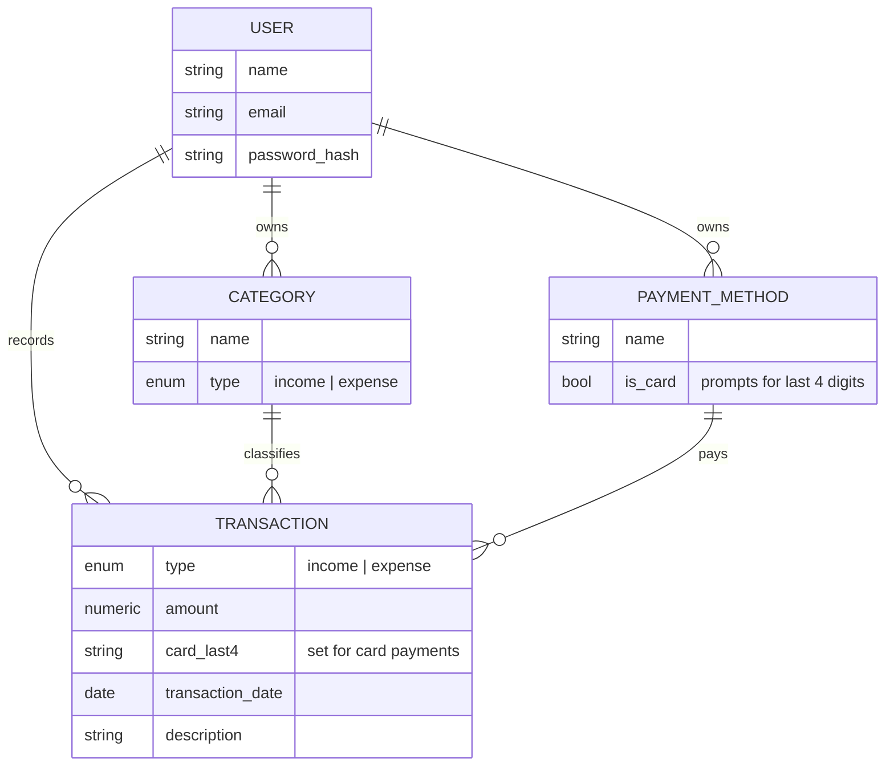
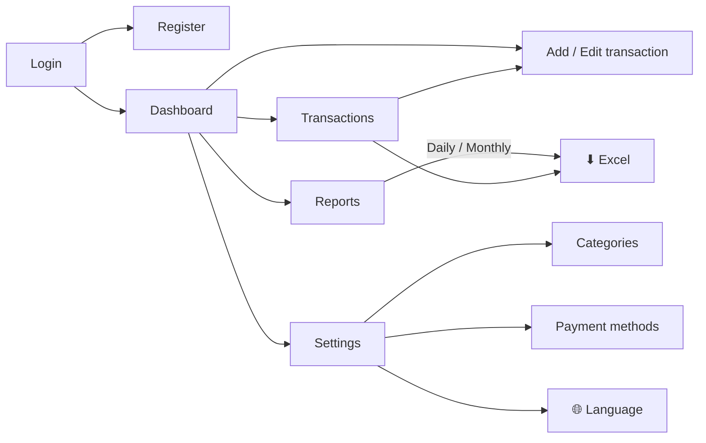

<div align="center">

# 💰 Sumly

### Simple daily income & expense tracking — built for the Uzbek market

**Multi-language** (O'zbekcha · Русский · English) · **Mobile-first** · **Excel export** · **Runs fully in Docker**

`Go` · `Gin` · `PostgreSQL` · `GORM` · `React` · `TypeScript` · `Tailwind` · `JWT`

</div>

---

## ✨ What Sumly does

| | Feature | Description |
|---|---|---|
| 📝 | **Fast entry** | Record an income or expense in seconds — one tap from anywhere |
| 💳 | **Cash or card** | Mark a method as a card and capture the **last 4 digits** automatically |
| 📊 | **Live dashboard** | Total balance + today's and this month's income / expense / net profit |
| 🔍 | **Powerful filters** | By type, category, payment method and date range, with pagination |
| 🏷️ | **Categories & methods** | Manage your own, seeded with sensible defaults on sign-up |
| 📅 | **Reports** | Daily breakdown and monthly summaries |
| 📁 | **Excel export** | Download filtered transactions or a full monthly workbook as real `.xlsx` |
| 🌐 | **3 languages** | Switch between Uzbek, Russian and English instantly |
| 📱 | **Mobile-first UI** | Bottom tab bar with a big central **＋** for adding on the go |

---

## 🚀 Run it — one command

> You only need **Docker** installed. Postgres, the Go API and the React app all build and start together.

```bash
docker compose up --build
```

<div align="center">

| Open | URL |
|---|---|
| 📱 **App** | <http://localhost:3000> |
| 🔌 API | <http://localhost:8080/api> |
| ❤️ Health | <http://localhost:8080/health> |

</div>

Register an account → default categories & payment methods are created for you → start tracking.
Stop with `docker compose down` (add `-v` to also wipe the database).

---

## 🧱 How it's put together



One `docker compose up` starts all three boxes. The frontend talks to the API through **same-origin `/api`** paths — nginx proxies them in production, Vite proxies them in dev. No API URL is ever hard-coded.

### Clean, layered backend



Each layer has one job. Business logic never sees an HTTP request, and only repositories touch the database — so features are easy to add and test.

---

## 🗂️ Data model



Every record is scoped to its owner — a user can only ever see and touch their own data.

---

## 📱 Mobile-first experience

The mobile layout centers on a **bottom tab bar** with an elevated **＋** for the most common action: adding a transaction.

```text
┌─────────────────────────────┐        ┌─────────────────────────────┐
│  S  Sumly          [O'zbek▾]│        │  ← Add transaction          │
├─────────────────────────────┤        ├─────────────────────────────┤
│  Total balance              │        │   ( Expense )   Income      │
│  1 250 000 so'm             │        │                             │
│                             │        │  Amount                     │
│  ┌─────────┐ ┌─────────┐    │        │  [  75 000            ]     │
│  │ Today   │ │ Month   │    │        │  Category                   │
│  │ +200000 │ │ +900000 │    │        │  [ Food            ▾ ]      │
│  └─────────┘ └─────────┘    │        │  Payment method             │
│                             │        │  [ Card            ▾ ]      │
│  Recent                     │        │  💳 Card last 4 digits      │
│  • Food    Card ••4242      │        │  [ 4 2 4 2 ]                │
│  • Sales   Cash             │        │                             │
│                             │        │  [      Save        ]       │
├──────┬──────┬───┬──────┬────┤        └─────────────────────────────┘
│ 🏠   │ 📊   │(＋)│ 🧾   │ ⚙  │
│ Home │Report│Add│ Tx   │Set │   ← bottom tab bar, central + is raised
└──────┴──────┴───┴──────┴────┘
```

On desktop the same screens use a left sidebar instead. **Settings** groups categories, payment methods, language and logout.

---

## 🧭 Screen map



---

## 📁 Project structure

```text
sumly/
├── 🐳 docker-compose.yml      → one command runs the whole stack
│
├── ⚙️  backend/                Go REST API (clean architecture)
│   ├── cmd/server             entrypoint
│   ├── internal/
│   │   ├── config             env-based configuration
│   │   ├── database           connection + auto-migration
│   │   ├── models             User · Category · PaymentMethod · Transaction
│   │   ├── repositories       data access (GORM lives here only)
│   │   ├── services           business logic + Excel export
│   │   ├── handlers           HTTP layer
│   │   ├── middleware         JWT auth
│   │   └── routes             wires it all together
│   ├── migrations             canonical SQL schema
│   └── Dockerfile
│
└── 🌐 frontend/               React + TypeScript SPA
    ├── src/
    │   ├── api                axios client + per-resource modules
    │   ├── components         Layout, bottom tab bar, cards, icons…
    │   ├── pages              one file per screen
    │   ├── i18n               uz / ru / en dictionaries + hook
    │   ├── store              auth · language · toasts (Zustand)
    │   └── types              shared TypeScript types
    ├── nginx.conf             serves SPA + proxies /api
    └── Dockerfile
```

---

## 🔌 API at a glance

<div align="center">

| Area | Endpoints |
|---|---|
| **Auth** | `POST /register` · `POST /login` · `GET /me` |
| **Transactions** | `GET` · `POST` · `GET/PUT/DELETE /:id` · `GET /export` ⬇ |
| **Categories** | `GET` · `POST` · `PUT/DELETE /:id` |
| **Payment methods** | `GET` · `POST` · `PUT/DELETE /:id` |
| **Reports** | `GET /dashboard` · `GET /daily` · `GET /monthly` · `GET /monthly/export` ⬇ |

</div>

All under `/api`. Protected routes need `Authorization: Bearer <token>`. Responses are consistent JSON envelopes (`{ "data": … }` / `{ "error": … }`), and lists include pagination `meta`. Transaction filters: `type`, `category_id`, `payment_method_id`, `date_from`, `date_to`, `page`, `page_size`.

---

## 🛡️ Built-in by default

- 🔐 **JWT auth** on every protected route · **bcrypt** password hashing
- 👤 **Strict ownership** — all queries scoped by user
- ✅ **Validation** on payloads and business rules (e.g. card payments require 4 digits)
- ⚡ **PostgreSQL indexes** on hot query paths · pagination everywhere
- 🧾 **Atomic sign-up** — user + default categories/methods seeded in one transaction

> **Before deploying:** set a strong random `JWT_SECRET` (see `.env.example`).

---

## 🛠️ Local development (without Docker)

<details>
<summary>Run the backend and frontend directly</summary>

**Backend** (needs Go 1.22+ and a Postgres — e.g. `docker compose up db`):

```bash
cd backend && cp .env.example .env && go run ./cmd/server
```

**Frontend** (needs Node 20+):

```bash
cd frontend && cp .env.example .env && npm install && npm run dev
```

Vite serves on <http://localhost:5173> and proxies `/api` to the backend.

</details>

---

## 🔮 Designed to grow

The MVP stays small, but the structure leaves room for what's next — **multiple cash accounts**, **debt tracking**, **PDF reports**, a **Telegram bot**, and **multi-branch / team roles** — each addable as new services and handlers reusing the existing repositories, without a rewrite.

<div align="center">

**Sumly** — track every so'm. 🇺🇿

</div>
